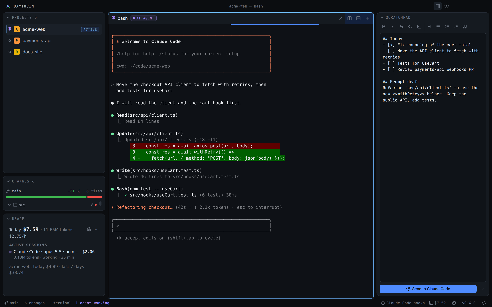
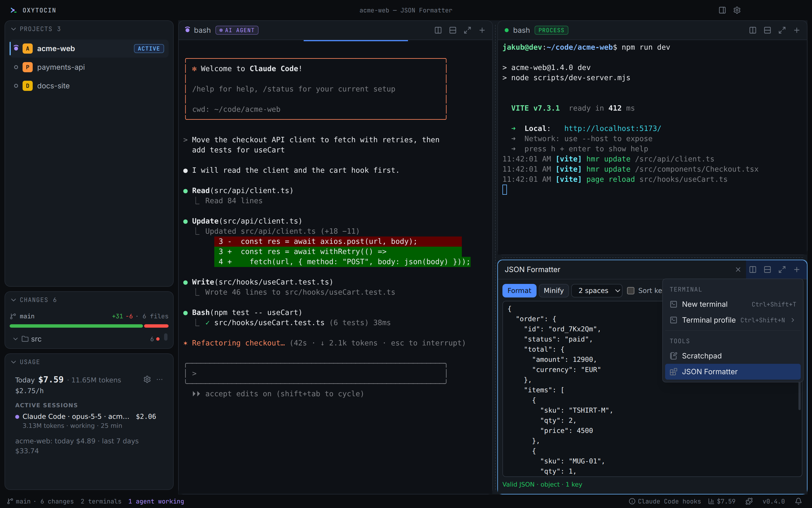
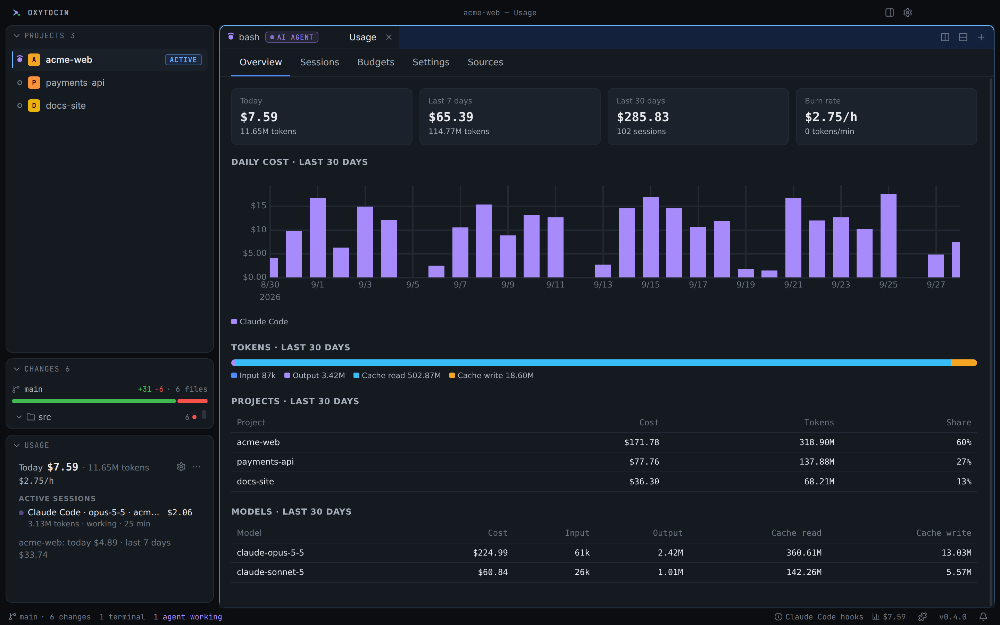

<p align="center">
  <picture>
    <source media="(prefers-color-scheme: dark)" srcset="resources/brand/svg/logo-horizontal-on-dark.svg" />
    
  </picture>
</p>

<p align="center">
  <strong>An IDE for the terminal and AI.</strong><br />
  One window for your projects, AI agent terminals, live git changes and token usage.
</p>

<p align="center">
  <a href="https://github.com/JakubKonkol/Oxytocin/releases/latest"></a>
  <a href="https://github.com/JakubKonkol/Oxytocin/actions/workflows/ci.yml"></a>
  <a href="LICENSE"></a>
  
</p>

<p align="center">
  
</p>

---

You run Claude Code in one terminal, Codex in another and a dev server in a third — across four projects. Which agent
is waiting for your answer? What did it just change? How much has it cost today?

**Oxytocin** puts all of that in one window. It is **not** a code editor — keep using the editor you like. It is the
place where your projects, agent terminals, live git changes and token usage live side by side.

<p align="center">
  <a href="https://github.com/JakubKonkol/Oxytocin/releases/latest"><strong>Download for Windows, macOS or Linux →</strong></a>
</p>

## Features

### 🗂️ Projects with live activity

Every folder is a project with its own colour, icon and workspace layout. Status dots show at a glance whether an
agent is **working**, **waiting for you**, a process is running or something failed. Switching projects is instant
and never kills a process; layouts and terminal scrollback come back after a restart.

### 🖥️ Terminals built for agents

- node-pty + xterm.js (WebGL) with tabs, splits, drag and drop and **floating groups**.
- Shell detection (PowerShell, cmd, Git Bash, WSL, bash, zsh, fish) and launch profiles for agents.
- **Shift+Enter** inserts a newline in Claude Code, image pastes reach the agent, plus search and shell integration
  (command marks, exit codes, "command finished" notifications).
- **Clickable file paths:** `Ctrl+click` a file an agent mentions (`CLAUDE.md`, `src/app.ts:42`) to open it in a
  **preview tab** — Markdown rendered, code highlighted and scrolled to the line. `Ctrl+Shift+click` opens your editor.
- **Agent detection** for Claude Code, Codex CLI, Gemini CLI, Aider and more — with OS notifications, an attention
  badge and `Ctrl+Shift+J` to jump straight to the agent that is waiting for you.
- Offers to **resume agent sessions** after a restart (never automatically).

### 🧰 A modular workspace

The **+** of every tab group opens a new terminal (with any profile) or a **tool**: the scratchpad, the JSON Formatter
or any plugin panel. Tools split, stack and float exactly like terminals. Drag one onto the **right sidebar** (or the
left one) to keep it next to you in every project, move it between the sidebars, and drag it back whenever you like.

<p align="center">
  
</p>

The right sidebar starts with the **scratchpad** — notes, to-do lists and prompt drafts with a Markdown toolbar,
lists that continue on Enter and your choice of font. **Send to agent** (`Ctrl+Enter`) pastes the text into a running
agent without submitting it. Close the scratchpad, reorder the sections or add other tools with **Add tool**.

### ▶️ Run your apps

The **Project Runner** finds what a project can run — `package.json` scripts (Next.js, Vite, Angular, …), .NET
projects with their launch URLs, Django/FastAPI/Flask apps, Go, Rust, Spring Boot, Laravel, Rails, Docker Compose —
and starts it with one click. Add the **Run** tool to a sidebar (**Add tool** in the right sidebar, then move it to the
left one if you like): it shows every app's status and the URL it serves; its output stays in a terminal you can open
at any time. Add your own run profiles (command, folder, environment) per project.

Agents can use it too: through Oxytocin's MCP server Claude Code can list, start, restart and stop your apps and read
their logs — and you see in the Run tool what the agent started.

### 🤖 Tools for your agents

Oxytocin is a local **MCP server** your agents connect to once (**Settings → Agent Tools → Connect Claude Code**, or
copy the config for Codex CLI, Cursor and others). Agents get Oxytocin's own tools — see the projects and terminals,
read another terminal's output (a dev server, a test run), notify you, ask you something in a dialog, open a file for
you — plus the tools of your plugins, which appear in running sessions as soon as you turn a plugin on. Every tool can
be switched off or set to ask you first, and the recent calls are listed (without their arguments).

### 🗄️ Databases and APIs for your agents

Describe a project's resources in **Project settings** (right-click the project): its **databases** — PostgreSQL,
CockroachDB, SQL Server, MySQL, MariaDB, MongoDB, SQLite, Redis/Valkey, ClickHouse and Oracle — its **HTTP APIs**
(base URL, authentication, OpenAPI), log files, links and related projects. *Test connection* works like in an IDE,
and *Import from project…* finds connection strings in `.env`, `appsettings.json`, Spring, docker-compose and Prisma
files. Agents then read the schema, query the data and call the API through Oxytocin's tools (`oxy_db_query`,
`oxy_api_request`, …): Oxytocin adds the credentials (encrypted with your OS keychain, never shown to the agent) and
enforces what you allowed — read-only by default (a real SQL parser checks every statement; reads also run in
read-only transactions), *ask before writes* with the full statement in a dialog, or read-write for development
databases. Secret columns are masked, results are capped, and every query is kept in the call log. Claude Code
sessions are told about the resources with their first prompt, so agents stop hunting for connection strings.

### 🔍 Live changes

A live tree of every file changed since `HEAD`, with line counts, and a Monaco diff viewer that updates while the
agent writes. One click opens the file in VS Code, Cursor, Windsurf, Zed, JetBrains IDEs, Sublime Text or a terminal
editor.

### 📊 Usage Monitor

Tokens and cost per session, project and model — read from your agents' **local logs** (Claude Code, Codex CLI,
Gemini CLI), with an optional local OTLP receiver. Daily charts, burn rate, budgets with alerts and a status bar
counter. On a Claude Pro/Max plan it shows the real **5-hour and weekly limits** instead of API-equivalent costs. The
gear in the Usage card opens its settings. Nothing leaves your machine.

<p align="center">
  
</p>

### 🧩 Plugins

Plugins are plain HTML/JS/CSS: views run in sandboxed iframes, backends in a separate Plugin Host process. They add
sidebar views, panels and tools, status bar items, commands, settings, terminal profiles, agent rules and tools for AI
agents.

| Built-in plugin | What it does |
|---|---|
| **Usage Monitor** | Token usage, costs, budgets and Claude subscription limits |
| **File Preview** | Live preview of Markdown (rendered) and code (highlighted) — from terminal links and the Changes list |
| **Project Runner** | Detects runnable apps, runs them with status, URLs and logs, and lets agents run them (MCP tools) |
| **Claude Code Bridge** | Exact Claude Code states (working, waiting for permission, finished) through Claude Code hooks |
| **JSON Formatter** | Format, minify and validate JSON next to the terminal or in the right sidebar |

Start your own with `npm create oxytocin-plugin` — see the [plugin developer guide](docs/plugins/README.md).

### ⌨️ Keyboard first

A **command palette** (`Ctrl+Shift+P`), **Quick Open** for projects, terminals and changed files (`Ctrl+Shift+O`), a
keyboard shortcut editor, a settings UI generated from the settings schema, and dark, light and system themes.

## Installation

Download the latest installer from **[Releases](https://github.com/JakubKonkol/Oxytocin/releases/latest)**:

| Platform | Package |
|---|---|
| Windows 10/11 (primary platform) | `Oxytocin-Setup-x.y.z.exe` |
| macOS | `.dmg` |
| Linux | `.AppImage` / `.deb` |

The builds are not code-signed yet, so Windows SmartScreen ("More info → Run anyway") and macOS Gatekeeper show a
warning on first start. Installed apps update themselves from GitHub Releases.

**Requirements:** `git` 2.30 or newer on `PATH` for the Changes panel.

## Development

Requires Node.js 24 (see `.nvmrc`) and npm 11.

```sh
npm install           # install dependencies (npm workspaces)
npm run dev           # run the app in development mode (renderer HMR)
npm run build         # production build into out/
npm run check         # typecheck + lint + unit/integration tests + license check
npm run e2e           # end-to-end tests (Playwright + Electron)
npm run screenshots   # regenerate the README screenshots from a demo setup (after npm run build)
npm run package:win   # Windows installer into release/ (also package:mac, package:linux)
```

### Architecture

```
src/main            Electron main process — orchestrates windows, IPC and the utility hosts
src/pty-host        utility process: node-pty terminals + headless xterm mirrors
src/workspace-host  utility process: file watching (@parcel/watcher) and git
src/plugin-host     utility process: plugin backends
src/connections-host utility process: database drivers, SQL guard and API requests of project resources
src/renderer        React 19 UI (dockview, xterm.js, Monaco)
src/preload         contextBridge API (window.oxy)
src/shared          pure TypeScript: domain types, IPC/RPC contracts, zod schemas
packages/           plugin API types, view SDK and the create-oxytocin-plugin template
plugins/            built-in plugins (they use the public plugin API only)
```

Terminal data flows directly between the renderer and the PTY Host over a MessagePort with sequence numbers and
ACK-based flow control, so busy agents never block the UI.

### Further reading

- [Writing plugins](docs/plugins/README.md) — manifest, backend API, views, debugging and distribution.
- [Releasing](docs/RELEASING.md) — packaging, code signing and auto-update.
- [Testing the database bridge](docs/testing-databases.md) — integration tests against real database servers.
- [Changelog](CHANGELOG.md)

## License

[MIT](LICENSE) © 2026 Jakub Konkol. Third-party licenses are listed in [THIRD_PARTY_NOTICES.md](THIRD_PARTY_NOTICES.md).
