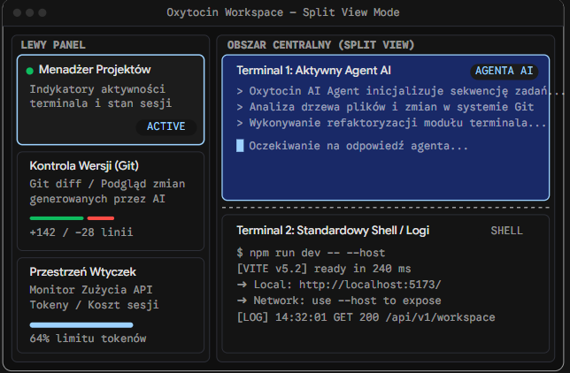

# 02 — UI/UX

## 1. Analiza prototypu (`ui_prototype.png`)



Co wynika z prototypu i co **musimy odwzorować**. **Uwaga:** prototyp ma polskie etykiety, ale **interfejs aplikacji jest wyłącznie po angielsku** (ADR-018) — obowiązujące angielskie etykiety są w §13.

| Element prototypu | Interpretacja / wymaganie |
|---|---|
| Ciemny motyw, prawie czarne tło, zaokrąglone „karty” z cienką ramką | Motyw domyślny „Oxytocin Dark”; sekcje sidebara i panele centralne jako karty (radius 8–10 px, border 1 px). |
| Tytuł okna „Oxytocin Workspace — Split View Mode”, systemowe przyciski okna | Własny pasek tytułu (frameless + `titleBarOverlay` na Windows/Linux, `hiddenInset` na macOS) z nazwą aktywnego projektu i trybem układu. |
| Nagłówki kolumn wersalikami, monospace, z odstępami liter („LEWY PANEL”, „OBSZAR CENTRALNY (SPLIT VIEW)”) | Etykiety sekcji: `font-family: var(--font-mono)`, `text-transform: uppercase`, `letter-spacing: .06em`, 11 px, kolor `--text-muted`. |
| Karta „Menadżer Projektów” z zieloną kropką i znaczkiem „ACTIVE”, podświetloną ramką | Sekcja **PROJECTS**; aktywny element: jasnoniebieska ramka (focus/active), zielona kropka = coś działa, badge `ACTIVE`. |
| Karta „Kontrola Wersji (Git)” z paskiem zielono-czerwonym i „+142 / −28 linii” | Nagłówek sekcji **CHANGES**: pasek proporcji dodanych/usuniętych linii + sumy (`+142 −28`). |
| Karta „Przestrzeń Wtyczek” — „Monitor Zużycia API, Tokeny / Koszt sesji”, pasek „64% limitu tokenów” | Slot sidebara dla wtyczek; **USAGE** pokazuje pasek postępu limitu/budżetu (`64% of daily budget`). |
| Obszar centralny podzielony poziomo, przerywana linia między panelami | Dockview; separator (sash) stylizowany jako przerywana linia 1 px, podświetlana przy hover. |
| Panel „Terminal 1: Aktywny Agent AI” z badge „AGENTA AI”, niebieskie tło/ramka | Nagłówek panelu terminala: tytuł + badge rodzaju (`AI AGENT` / `SHELL` / `PROCESS`); panel z fokusem ma akcentową ramkę i delikatny niebieski odcień nagłówka. |
| Panel „Terminal 2: Standardowy Shell / Logi” z badge „SHELL” | Terminal z powłoką i np. serwerem dev — badge `SHELL` (lub `PROCESS`, gdy działa długotrwały proces). |
| Treść terminali w monospace z kolorami ANSI | xterm.js z motywem kolorów spójnym z tokenami. |

## 2. Układ ekranu

```
┌─────────────────────────────────────────────────────────────────────────────────────┐
│ ◆ Oxytocin   api-server ▾  ⎇ main ↑2      [ ⌕ Search commands…  Ctrl+Shift+P ]  ▢ ✕ │ 36 px TitleBar
├───────────────────────┬─────────────────────────────────────────────────────────────┤
│ PROJECTS          + ⋯ │ ┌─ Claude Code · AI AGENT ● ───────────── ⋯ ┐┌─ npm run dev · PROCESS ┐│
│ ● api-server   ACTIVE │ │ > Analyzing the file tree…                  ││ VITE v7 ready in 240ms ││
│ ◐ web-app      ⚠ 1    │ │ ✳ Refactoring the terminal module…          ││ ➜ Local: :5173         ││
│ ○ docs                │ │                                             ││ [LOG] GET 200 /api/v1  ││
├───────────────────────┤ │                                             │└────────────────────────┘│
│ CHANGES  ⎇ main    ⟳ ⋯│ │                                             │┌─ pwsh · SHELL ─────────┐│
│ ███████████░░░ +142 −28│ │ █                                           ││ PS C:\dev\api>         ││
│ ▾ src          4      │ └─────────────────────────────────────────────┘└────────────────────────┘│
│   M  app.ts   +12 −3  │                                                             │
│   A  new.ts   +40     │                   (dockview: groups, tabs, splits)          │
│   D  old.ts       −25 │                                                             │
├───────────────────────┤                                                             │
│ USAGE               ⋯ │                                                             │
│ Today $4.82 · 1.2M tok│                                                             │
│ ████████████░░░░ 64%  │                                                             │
│ ● Claude · opus  $2.31│                                                             │
├───────────────────────┴─────────────────────────────────────────────────────────────┤
│ ⎇ main ↑2 · 7 changes │ 3 terminals · 1 agent working        $4.82 today │ 🔔 1 │ UTF-8│ 24 px StatusBar
└─────────────────────────────────────────────────────────────────────────────────────┘
```

| Strefa | Wymiary / zachowanie |
|---|---|
| TitleBar | 36 px; obszar przeciągania okna (`-webkit-app-region: drag`), elementy interaktywne `no-drag`. Na Windows `titleBarOverlay: { color: var(--bg-app), symbolColor: var(--text-secondary), height: 36 }` — kolory aktualizowane przy zmianie motywu (`win.setTitleBarOverlay`). |
| Sidebar | Domyślnie 300 px, min 220, max 520, zmiana szerokości przeciąganiem, zwijanie (Ctrl+Shift+B), szerokość zapisywana. Zawartość: `PaneviewReact` z sekcjami (każda zwijana, z regulowaną wysokością, kolejność przeciąganiem). |
| Obszar centralny | `DockviewReact` — jeden na zamontowany projekt; tło `--bg-app`, odstęp 8 px między kartami paneli. |
| StatusBar | 24 px; lewa strona: rdzeń (git, terminale, agenci); prawa: elementy wtyczek + powiadomienia. |

Minimalny rozmiar okna: 900 × 560. Poniżej 1100 px szerokości sidebar automatycznie przechodzi w tryb węższy (ukrywa liczniki linii przy plikach).

## 3. Design tokens (CSS variables) — motyw „Oxytocin Dark”

Plik `src/renderer/src/styles/tokens.css`. Te same tokeny trafiają do: Tailwind (`@theme` mapuje na `var(--…)`), dockview (`--dv-*`), xterm (`ITheme` budowany z tokenów w `lib/theme.ts`), Monaco (`defineTheme`), wtyczek (wstrzykiwane do iframe przez SDK).

```css
:root[data-theme='dark'] {
  /* Surfaces */
  --bg-app: #0b0d10;          /* window background */
  --bg-surface: #111418;      /* column background */
  --bg-card: #151a20;         /* section and panel cards */
  --bg-card-hover: #1a2028;
  --bg-elevated: #1c222b;     /* menus, dialogs, tooltips */
  --bg-input: #0f1318;
  --bg-terminal: #0e1116;
  --bg-focus-tint: #13213d;   /* focused panel header */

  /* Borders */
  --border-subtle: #232932;
  --border-default: #2c333d;
  --border-strong: #3a4350;
  --border-focus: #6cb6ff;    /* light-blue border of the active card/panel */

  /* Text */
  --text-primary: #e6e8eb;
  --text-secondary: #a8b0bb;
  --text-muted: #6e7682;
  --text-inverse: #0b0d10;

  /* Accents and states */
  --accent: #4f8cff;
  --accent-muted: #1d3566;
  --success: #22c55e;         /* green "running" dot */
  --warning: #f5a524;         /* "waiting for you" */
  --danger: #ef4444;
  --info: #38bdf8;
  --agent: #a78bfa;           /* purple for AI agents (working indicator) */

  /* Git */
  --git-added: #3fb950;
  --git-modified: #d29922;
  --git-deleted: #f85149;
  --git-renamed: #a371f7;
  --git-untracked: #56d364;
  --git-conflict: #ff7b72;

  /* Typography */
  --font-ui: 'Inter', system-ui, 'Segoe UI', sans-serif;
  --font-mono: 'JetBrains Mono', 'Cascadia Mono', Consolas, monospace;
  --font-size-ui: 13px;
  --font-size-small: 11px;

  /* Shapes */
  --radius-card: 10px;
  --radius-control: 6px;
  --radius-badge: 4px;
  --gap-layout: 8px;
  --shadow-elevated: 0 8px 24px rgb(0 0 0 / 0.45);

  /* Motion */
  --motion-fast: 120ms;
  --motion-normal: 200ms;
}
```

Motyw jasny (`data-theme='light'`) — w M7; ustawienie `appearance.theme: 'dark' | 'light' | 'system'`. Każdy komponent używa wyłącznie tokenów (lint: zakaz literałów kolorów w `.tsx` poza `tokens.css`).

**Paleta ANSI terminala (dark):** black `#1b1f24`, red `#ff6b6b`, green `#3fd97f`, yellow `#f5c542`, blue `#5aa2ff`, magenta `#c38bff`, cyan `#3ad0e0`, white `#d7dce2`; bright: `#5c6370`, `#ff8787`, `#6ee7a0`, `#ffd866`, `#82b8ff`, `#d6a8ff`, `#67e8f9`, `#f5f7fa`; foreground `#e6e8eb`, background `var(--bg-terminal)`, cursor `#6cb6ff`, selection `#264f78` (alpha 0.6).

**Fonty:** Inter (UI) i JetBrains Mono (etykiety, terminal fallback) dołączone lokalnie (licencja OFL) w `src/renderer/src/assets/fonts` — **bez Google Fonts** (offline, CSP). Domyślna czcionka terminala: `"Cascadia Mono", "JetBrains Mono", Consolas, monospace` (Cascadia Mono jest w Windows 11).

## 4. Biblioteka komponentów (`src/renderer/src/ui/`)

| Komponent | Opis |
|---|---|
| `Section` | Karta sekcji sidebara: nagłówek (etykieta mono uppercase, licznik, akcje ikonowe), ciało przewijane. Zintegrowana z Paneview (nagłówek = header pane'a). |
| `StatusDot` | Kropka statusu z wariantami i animacjami (§6). Props: `state`, `size`, `title` (tooltip z opisem). |
| `Badge` | Mały znaczek (mono, uppercase, 10 px): warianty `agent`, `shell`, `process`, `active`, `neutral`, `warning`, `danger`. |
| `IconButton` | 24×24, tooltip z nazwą + skrótem (`Kbd`). |
| `Tree` | Wirtualizowane drzewo (`@tanstack/react-virtual`) z nawigacją klawiaturą i ARIA `tree`/`treeitem`. Używane w Zmianach (i przez przyszłe wtyczki przez SDK? — nie, wtyczki mają własne UI). |
| `ProgressBar` | Pasek z progami kolorów (ok/warn/danger) — Usage i budżety. |
| `SplitBar` | Pasek proporcji (+/−) dla Zmian. |
| `ContextMenu`, `DropdownMenu` | Radix, ze skrótami po prawej. |
| `Dialog`, `ConfirmDialog` | Radix Dialog; `ConfirmDialog` z wariantem destrukcyjnym (czerwony przycisk, domyślny fokus na „Cancel”). |
| `Toast` | sonner; warianty info/success/warning/error; akcje (np. „Undo”). |
| `Kbd` | Renderuje skrót zależnie od platformy (Ctrl vs ⌘). |
| `EmptyState` | Ikona + tytuł + opis + akcje. |
| `Spinner` / `AgentPulse` | Animacja pracy agenta. |

## 5. Sekcje i panele — specyfikacja wizualna

### 5.1 Sekcja PROJECTS
Opisana szczegółowo w [03-projects-workspace.md §4](03-projects-workspace.md). Element listy (wysokość 32 px): `StatusDot` · nazwa (pogrubiona dla aktywnego) · opcjonalnie gałąź git (muted) · po prawej badge (np. `ACTIVE`, liczba agentów czekających `⚠ 1`). Aktywny projekt: tło `--bg-card-hover` + lewa belka 2 px `--border-focus`.

### 5.2 Sekcja CHANGES
Opisana w [06-git-changes.md §6](06-git-changes.md). Nagłówek: `⎇ gałąź` + `↑ahead ↓behind`, `SplitBar` proporcji +/−, sumy `+142 −28`, liczba plików; akcje: odśwież, zwiń wszystko, tryb drzewo/lista, filtr.

### 5.3 Sekcje wtyczek
Każdy widok wtyczki zarejestrowany w slocie `sidebar` to osobny pane z nagłówkiem (tytuł z manifestu, ikona, akcje z manifestu). Treść = iframe wypełniający pane. Usage Monitor domyślnie jako trzecia sekcja (zgodnie z prototypem).

### 5.4 Panel terminala (dockview)
- Gdy grupa ma jeden panel: `singleTabMode: 'fullwidth'` — nagłówek wygląda jak tytuł karty (jak w prototypie): `ikona profilu · tytuł · BADGE · StatusDot` + akcje (split →, split ↓, maksymalizuj, ⋯).
- Gdy grupa ma wiele paneli: taby; aktywny tab z dolną belką akcentu.
- Badge rodzaju: `AI AGENT` (fiolet `--agent`, z `AgentPulse` gdy pracuje; `WAITING` na pomarańczowo gdy `waiting`), `PROCESS` (zielony, gdy działa proces potomny powłoki, np. `npm run dev`), `SHELL` (neutralny), `EXITED (code)` (czerwony przy kodzie ≠ 0).
- Fokus: ramka 1 px `--border-focus` + nagłówek z tłem `--bg-focus-tint`. Opcja `terminal.dimInactive` (przyciemnienie nieaktywnych paneli o 15%).
- Separator między grupami: 1 px przerywana linia `--border-default` (dashed), hover/drag → `--accent` ciągła.

### 5.5 Pasek statusu
Lewa strona (rdzeń): `⎇ main ↑2` (klik → fokus Zmian) · `7 changes` · `3 terminals` · `1 agent working · 1 waiting` (klik → skok do terminala). Prawa: elementy wtyczek wg priorytetu (Usage: `$4.82 today`), dzwonek powiadomień z licznikiem, wersja/aktualizacje (M9).

## 6. Wskaźniki stanu i animacje

| Stan (`ProjectActivity` / terminal) | Wygląd `StatusDot` | Animacja | Znaczenie |
|---|---|---|---|
| `none` | brak kropki (puste miejsce) | — | Brak terminali. |
| `idle` | kółko obrysowane `--text-muted` | — | Terminale otwarte, nic nie działa. |
| `running` | pełna kropka `--success` | brak (statyczna) | Działa proces (np. dev server). |
| `agent-working` | kropka `--agent` | „oddech” (opacity 0.45↔1, 1.6 s) + obracający się półokrąg | Agent AI pracuje. |
| `attention` | kropka `--warning` | pulsujący pierścień (scale 1→1.8, fade, 1.2 s) | Agent czeka na decyzję / wejście. **Najwyższy priorytet.** |
| `error` | kropka `--danger` | krótkie mignięcie przy pojawieniu | Proces zakończył się kodem ≠ 0 i użytkownik tego jeszcze nie widział. |

- `prefers-reduced-motion` i ustawienie `appearance.reduceMotion` → animacje zastąpione statycznymi ikonami (np. ⚠ dla attention).
- Tooltip kropki zawsze opisuje stan słownie („Claude Code is waiting for tool permission · 2 min”).
- Świeżo zmienione pliki w Zmianach: tło wiersza pulsuje raz (`--accent-muted` → transparent, 1.5 s) + ikona „na żywo” przy pliku zmienionym w ostatnich 5 s.

## 7. Skróty klawiszowe

**Zasada nadrzędna:** gdy fokus jest w terminalu, aplikacja przechwytuje **tylko** skróty z `Ctrl+Shift+…`, `Alt+Shift+…`, `Ctrl+Alt+…` i klawisze funkcyjne. Pojedyncze `Ctrl+<litera>` należą do powłoki/agenta (Claude Code używa m.in. Ctrl+B, Ctrl+O, Ctrl+R, Ctrl+T, Ctrl+J, Ctrl+L, Esc Esc, Shift+Tab). Wyjątki konfigurowalne: Ctrl+C (kopiuj, gdy jest zaznaczenie) i Ctrl+V (wklej).

| Akcja | Windows / Linux | macOS |
|---|---|---|
| Paleta poleceń (M7) | Ctrl+Shift+P | ⌘⇧P |
| Quick Open: projekty/pliki zmienione/terminale (M7) | Ctrl+Shift+O | ⌘⇧O |
| Nowy terminal (profil domyślny) w aktywnej grupie | Ctrl+Shift+T | ⌘T |
| Nowy terminal z wyborem profilu | Ctrl+Shift+N | ⌘⇧N |
| Podziel w prawo (nowy terminal, ten sam profil i cwd) | Alt+Shift+= (Alt+Shift+Plus) | ⌘D |
| Podziel w dół | Alt+Shift+- (Alt+Shift+Minus) | ⌘⇧D |
| Zamknij panel | Ctrl+Shift+W | ⌘W |
| Przenieś fokus między panelami | Alt+←/→/↑/↓ | ⌥⌘←/→/↑/↓ |
| Zmień rozmiar panelu | Alt+Shift+←/→/↑/↓ | ⌃⇧⌘←/→/↑/↓ (M7-T2: ⌃⌘↑/↓ należą do przełączania projektów) |
| Maksymalizuj / przywróć panel | Ctrl+Shift+Enter | ⌘⇧Enter |
| Następny / poprzedni tab w grupie | Ctrl+Tab / Ctrl+Shift+Tab | ⌃Tab / ⌃⇧Tab |
| Projekt 1–9 | Ctrl+Alt+1…9 | ⌃⌘1…9 |
| Następny / poprzedni projekt | Ctrl+Alt+↓ / Ctrl+Alt+↑ | ⌃⌘↓ / ⌃⌘↑ |
| Skocz do terminala, który czeka na mnie | Ctrl+Shift+J | ⌘⇧J |
| Fokus: Projekty / Zmiany / obszar centralny | Ctrl+Shift+E / Ctrl+Shift+G / Ctrl+Shift+` | ⌘⇧E / ⌃⇧G / ⌘⇧` |
| Pokaż/ukryj sidebar | Ctrl+Shift+B | ⌘⇧B |
| Szukaj w terminalu | Ctrl+Shift+F | ⌘F |
| Kopiuj / wklej | Ctrl+Shift+C / Ctrl+Shift+V (+ Ctrl+C przy zaznaczeniu, Ctrl+V) | ⌘C / ⌘V |
| Wyczyść terminal | Ctrl+Shift+K | ⌘K |
| Zoom UI | Ctrl+= / Ctrl+- / Ctrl+0 (poza terminalem) | ⌘= / ⌘- / ⌘0 |
| Zoom czcionki terminala | Ctrl+Shift+= / Ctrl+Shift+- | ⌘⇧= / ⌘⇧- |
| Dodaj projekt | Ctrl+Shift+A (poza terminalem) | ⌘⇧A |

Implementacja: `KeybindingService` w rendererze (`lib/keybindings.ts`) z kontekstami `when` (`terminalFocus`, `sidebarFocus`, `changesFocus`, `diffFocus`, `pluginViewFocus`, `inputFocus`), mapą domyślną i nadpisaniami użytkownika z `keybindings.json` (M7). Terminal używa `attachCustomKeyEventHandler`, który zwraca `false` dla skrótów rozpoznanych przez `KeybindingService`. Widoki wtyczek przekazują zdarzenia `keydown` przez SDK (patrz [07 §7.6](07-plugin-engine.md)).

## 8. Paleta poleceń i Quick Open (M7)

- `cmdk` w dialogu na górze okna. Źródła: polecenia rdzenia (`oxytocin.*`), polecenia wtyczek (z manifestów), ostatnio używane na górze.
- Quick Open: prefiks brak = projekty + zmienione pliki aktywnego projektu + terminale; `>` = polecenia; `@` = terminale; `#` = pliki zmienione.
- Każde polecenie: `id`, `title` (po angielsku, np. „Terminal: Split Right”), `category`, `icon?`, `keybinding?`, `when?`, `run(args)`.
- Przed M7 polecenia istnieją w rejestrze i są dostępne z menu kontekstowych i skrótów — paleta to tylko nowy frontend.

## 9. Powiadomienia i system „uwagi”

| Zdarzenie | In-app (toast) | Systemowe (OS) | Inne |
|---|---|---|---|
| Agent przechodzi w `waiting` | tak, gdy projekt nieaktywny lub terminal niewidoczny | tak, gdy okno bez fokusu | Windows: `flashFrame(true)` + overlay icon z liczbą czekających; macOS: badge w Docku; tytuł okna z prefiksem `(1)`. |
| Agent kończy pracę (`working` → `idle`) po > 30 s pracy | tak (cichy), gdy terminal niewidoczny | opcjonalnie (`notifications.agentFinished`) | |
| Proces kończy się kodem ≠ 0 | tak | nie (domyślnie) | Kropka `error` przy projekcie do czasu obejrzenia terminala. |
| BEL w niewidocznym terminalu | nie | nie | Ikona dzwonka na tabie do czasu fokusu. |
| Przekroczenie progu budżetu (Usage) | tak | tak (raz na próg) | |

Kliknięcie powiadomienia: fokus okna → aktywacja projektu → fokus panelu terminala. Ustawienia `notifications.*` w [09-persistence-settings.md](09-persistence-settings.md). Tryb „Do not disturb” (przełącznik w pasku statusu) wycisza powiadomienia OS.

## 10. Pierwsze uruchomienie (onboarding)

1. Ekran powitalny w obszarze centralnym: logo, „Add your first project” (przycisk + strefa drop), skrót klawiszowy.
2. Wykrycie zainstalowanych narzędzi: git (wersja), powłoki (pwsh, PowerShell, cmd, Git Bash, WSL), agenci (`claude`, `codex`, `gemini`, `aider`, `opencode` w PATH) → lista „Detected” z zielonymi ptaszkami, brakujące z linkiem do instalacji.
3. Krótka informacja o Usage Monitorze: „Oxytocin reads your agents' local logs to calculate costs. Nothing leaves your computer.” + przełącznik „Live telemetry (OTLP)” (domyślnie wyłączony, z opisem konsekwencji).

## 11. Dostępność

- Pełna obsługa klawiatury: wszystkie sekcje osiągalne skrótami, `Tab`/`Shift+Tab` w obrębie sekcji, strzałki w listach/drzewach, `Enter`/`Space` akcje, `Shift+F10`/klawisz Menu → menu kontekstowe.
- ARIA: lista projektów `listbox`, drzewo zmian `tree`, panele dockview z `aria-label` = tytuł panelu; `StatusDot` z `aria-label` opisującym stan.
- xterm: `screenReaderMode` przełączany ustawieniem `terminal.screenReaderMode` (koszt wydajności).
- Kontrast tekstu ≥ 4.5:1 dla `--text-secondary` na `--bg-card` (sprawdzić narzędziem przy tworzeniu tokenów).
- Widoczny focus ring (2 px `--border-focus`, offset 1 px) — nigdy `outline: none` bez zamiennika.
- Skalowanie UI: `webContents.setZoomFactor` (0.8–1.5) + niezależny rozmiar czcionki terminala.

## 12. Język interfejsu

- **Interfejs wyłącznie po angielsku** (ADR-018): etykiety, menu natywne, dialogi, toasty, powiadomienia OS, komunikaty błędów, tooltipy, ekran powitalny, UI wtyczek wbudowanych.
- **Bez frameworka i18n** (brak `i18next`, brak plików `locales/`, brak ustawienia języka). Teksty wpisywane bezpośrednio po angielsku; komunikaty błędów mapowane z `OxyError.code` w jednym module `src/renderer/src/lib/messages.ts` (ułatwi ewentualną lokalizację w przyszłości, gdyby kiedyś zapadła taka decyzja — wymagałaby nowego ADR).
- Styl tekstów: sentence case dla przycisków i menu („Split right”, „Open in editor”), Title Case w tytułach poleceń palety z kategorią („Terminal: Split Right”), wersaliki tylko w etykietach sekcji i badge'ach (`PROJECTS`, `AI AGENT`).
- Formatowanie liczb i dat przez `Intl.NumberFormat` / `Intl.DateTimeFormat` z locale `en-US` (koszty zawsze w USD: `$4.82`; daty względne „2 min ago”). Strefa czasowa — systemowa.
- Polskie etykiety widoczne w prototypie i w przykładach w tym planie są ilustracyjne — obowiązują angielskie odpowiedniki z §13.

## 13. Kanoniczne etykiety (angielskie)

| Element | Etykieta |
|---|---|
| Sekcje sidebara | `PROJECTS`, `CHANGES`, `USAGE` |
| Badge aktywnego projektu | `ACTIVE` |
| Badge rodzaju terminala | `AI AGENT`, `SHELL`, `PROCESS`, `EXITED (3)` |
| Stan agenta (badge/tooltip) | `WORKING` / „working”, `WAITING` / „waiting for you”, `IDLE` / „idle” |
| Stany aktywności projektu (tooltip) | „No terminals”, „Idle”, „Process running”, „Agent working”, „Needs your attention”, „Process exited with code 3” |
| Pasek statusu | `7 changes`, `3 terminals`, `1 agent working`, `1 waiting`, `$4.82 today` |
| Zmiany — stany puste | „No changes since HEAD”, „Not a git repository”, „Git not found”, „No commits yet — all files are new”, „Showing 5,000 of 23,118 changes — consider updating .gitignore” |
| Zmiany — statusy plików | `A` Added, `M` Modified, `D` Deleted, `R` Renamed, `U` Untracked, `C` Conflicted, `T` Type changed |
| Akcje | „New terminal”, „Split right”, „Split down”, „Close”, „Rename”, „Restart”, „Maximize”, „Open diff”, „Open in editor”, „Reveal in Explorer” (macOS: „Reveal in Finder”), „Copy path”, „Discard changes…”, „Commit…”, „Open preview” |
| Terminal — pasek zakończenia | „Process exited with code 3” + „Restart” / „Close” |
| Terminal — przywrócona sesja | `── Session restored · Sep 26, 2026 6:42 PM ──`, `── Restarted ──` |
| Terminal — środowisko | „Environment variables changed — restart the terminal to apply them” |
| Dialog wyjścia | „3 terminals have running processes (Claude Code in ‘api’, npm run dev in ‘web’). Quit anyway?” — „Quit” / „Cancel” |
| Dialog usunięcia projektu | „Remove ‘api’ from Oxytocin?” + checkbox „Also close its 2 terminals” |
| Brak folderu projektu | „Folder not found: C:\…” — „Locate folder…” / „Remove from list” |
| Usage — sidebar | „Today”, „Active sessions”, „working”, „waiting for you”, „of daily budget”, „resets in 1h 12m”, „No usage data yet. Start an agent (e.g. `claude`) in a terminal.” |
| Usage — dashboard | zakładki „Overview”, „Sessions”, „Budgets”, „Pricing”, „Sources” |
| Wtyczki | „Plugins”, „Enable”, „Disable”, „Reload”, „Show logs”, „Load plugin from folder…”, „Plugin ‘x’ is unavailable” |
