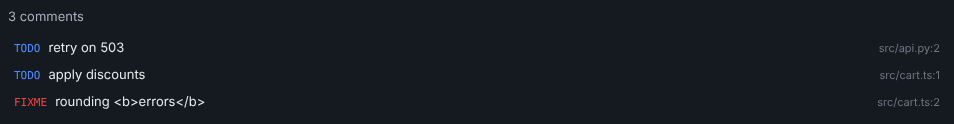

# Building Oxytocin plugins

Plugins extend Oxytocin with your own panels, sidebar views, status bar items, commands, settings and terminal
profiles — and with **tools that AI agents can call**. The built-in plugins (Usage Monitor, Project Runner, File
Preview, …) are written against the same public API you use here.

This guide walks you through building a complete plugin, then documents every part of the API.

- [How a plugin works](#how-a-plugin-works)
- [Quick start](#quick-start)
- [Tutorial: TODO Radar](#tutorial-todo-radar)
- [Reference](#reference) — [manifest](#the-manifest), [activation events](#activation-events),
  [contributions](#contributions), [permissions](#permissions), [backend API](#the-backend-api), [views](#views),
  [tools for AI agents](#tools-for-ai-agents)
- [Debugging](#debugging) · [Packaging and distribution](#packaging-and-distribution) ·
  [Security](#security) · [Best practices](#best-practices)

Plugin API version: **0.1.6** ([changelog](../../packages/plugin-api/CHANGELOG.md)). Until 1.0, minor versions may
contain breaking changes; declare the versions your plugin supports with `engine`.

## How a plugin works

A plugin is a folder with a `package.json`. Its `oxytocin` section — the **manifest** — declares what the plugin
contributes and which parts of the API it may use. Two optional parts do the work:

```
 Oxytocin window                                  Plugin Host (Node.js)
┌───────────────────────────────┐                ┌───────────────────────────────┐
│ view (sandboxed iframe)       │  view.request  │ backend: dist/host.js         │
│ HTML · JS · CSS · plugin SDK  │ ◄────────────► │ activate(ctx) → ctx.oxy.*     │
├───────────────────────────────┤  postMessage   │ Node.js APIs and npm packages │
│ status bar · commands · menus │ ◄────────────► │                               │
└───────────────────────────────┘                └───────────────────────────────┘
```

- The **backend** is an ES module that runs in the Plugin Host, a Node.js process separate from the window. It gets
  the `oxy` API (projects, terminals, agents, git, UI, commands, settings, MCP tools) and can use any Node.js API or
  npm package.
- **Views** are web pages shown in sandboxed iframes, as a panel (a tab in the workspace, or a tool in a sidebar) or as
  a sidebar section. They have no Node.js and no network; they talk to their backend through the view SDK
  (`@oxytocin/plugin-sdk`).

A plugin can be only a backend (a status bar item, a command, a tool for agents) or only views (the JSON Formatter is
a single page with no backend).

## Quick start

You need **Node.js 22+** and Oxytocin **0.9** or newer.

```sh
git clone https://github.com/JakubKonkol/Oxytocin.git
node Oxytocin/packages/create-oxytocin-plugin/index.js my-plugin
cd my-plugin
npm install
npm run dev
```

The generator asks for the plugin id (`publisher.name`), the display name, the publisher and a template — `vanilla`
TypeScript or `react` (or pass `--id acme.my-plugin --name "My Plugin" --publisher acme --template react --yes`). The
generated project already has a command, a status bar item and a panel whose view asks the backend for data.

Then, in Oxytocin:

1. Open **Plugins** (the puzzle icon in the status bar, or *Plugins: Show Plugins* in the command palette).
2. Turn on **Developer mode** and choose **Load plugin from folder…** → your `my-plugin` folder.
3. Run *My Plugin: Open* from the command palette (`Ctrl+Shift+P`).

While `npm run dev` runs, every save rebuilds the plugin and Oxytocin reloads it and its views.

```
my-plugin/
├── package.json        npm metadata + the "oxytocin" manifest
├── src/
│   ├── host.ts         backend → dist/host.js (ES module, dependencies bundled)
│   └── views/
│       ├── main.html   a view → dist/views/ (one page per .html file)
│       ├── main.ts
│       └── main.css
├── vendor/             view SDK and API types (copied by the generator)
├── build.mjs           esbuild (backend) + Vite (views); --watch, --zip
└── tsconfig.json
```

| Script | Does |
|---|---|
| `npm run dev` | Rebuilds on every change (Oxytocin reloads the plugin in developer mode) |
| `npm run build` | Builds `dist/` once |
| `npm run typecheck` | Type-checks backend and views |
| `npm run package` | Builds and creates `<id>-<version>.zip` for **Install from .zip…** |

## Tutorial: TODO Radar

Let's build a plugin that finds the `TODO` and `FIXME` comments of the active project. It shows their number in the
status bar, lists them in a panel (click one to open the file at that line), has a setting for the tags to look for,
and gives AI agents a `todos_list` tool so they can find unfinished work themselves.

<p align="center">
  
</p>

Start from a fresh project:

```sh
node Oxytocin/packages/create-oxytocin-plugin/index.js todo-radar --id acme.todo-radar --name "TODO Radar" --publisher acme --yes
cd todo-radar && npm install
```

### 1. The manifest

Replace the `oxytocin` section of `package.json`:

```json
"oxytocin": {
    "id": "acme.todo-radar",
    "displayName": "TODO Radar",
    "description": "Lists the TODO and FIXME comments of the active project.",
    "publisher": "acme",
    "engine": "^0.1.6",
    "main": "dist/host.js",
    "activationEvents": [
      "onStartup"
    ],
    "permissions": [
      "projects.read",
      "fs.read-project",
      "mcp.tools"
    ],
    "contributes": {
      "commands": [
        {
          "id": "todo-radar.open",
          "title": "TODO Radar: Open"
        },
        {
          "id": "todo-radar.rescan",
          "title": "TODO Radar: Rescan"
        }
      ],
      "panels": [
        {
          "type": "todo-radar.list",
          "title": "TODO Radar",
          "entry": "dist/views/main.html",
          "singleton": "project",
          "showInAddMenu": true
        }
      ],
      "statusBarItems": [
        {
          "id": "todo-radar.status",
          "alignment": "right",
          "priority": 40
        }
      ],
      "configuration": {
        "prefix": "todo-radar",
        "properties": {
          "todo-radar.tags": {
            "type": "string",
            "default": "TODO,FIXME",
            "description": "Comma-separated tags to look for."
          }
        }
      },
      "mcp": {
        "prefix": "todos",
        "tools": [
          {
            "name": "todos_list",
            "title": "List TODO comments",
            "description": "Lists the TODO and FIXME comments of the project with file and line. Use it to find unfinished work before starting a task.",
            "inputSchema": {
              "type": "object",
              "properties": {}
            },
            "annotations": {
              "readOnlyHint": true
            }
          }
        ]
      }
    }
  }
```

- `main` is the built backend; `activationEvents: ["onStartup"]` imports it when Oxytocin starts (the scan also runs
  for the status bar, so it should not wait until the panel opens).
- `permissions` are shown to users before the plugin runs: `projects.read` for `oxy.projects`, `mcp.tools` for the
  agent tool, and `fs.read-project` tells them the backend reads project files.
- `contributes` declares everything the UI shows before the backend runs: two commands for the command palette, a
  panel that is also a tool in the **+** menu (`showInAddMenu`, one per project), a status bar item, a setting and the
  agent tool.

### 2. The backend

The backend scans the project and keeps the status bar, the panels and the agent tool up to date. Replace
`src/host.ts`:

```ts
import { readdir, readFile } from 'node:fs/promises';
import { join, relative, sep } from 'node:path';
import type { PluginContext, PluginView, ProjectInfo } from '@oxytocin/plugin-api';

export interface Todo {
  file: string; // relative to the project, '/' separators
  line: number;
  tag: string;
  text: string;
}

const SKIP = new Set(['.git', 'node_modules', 'dist', 'build', 'out']);
const SOURCE = /\.(ts|tsx|js|jsx|mjs|py|go|rs|java|cs|rb|php|css|scss|html|md)$/i;
const MAX_TODOS = 500;

/** Source files below `dir`, skipping dependency and build folders. */
async function* sourceFiles(dir: string): AsyncGenerator<string> {
  for (const entry of await readdir(dir, { withFileTypes: true })) {
    const path = join(dir, entry.name);
    if (entry.isDirectory() && !SKIP.has(entry.name)) yield* sourceFiles(path);
    else if (entry.isFile() && SOURCE.test(entry.name)) yield path;
  }
}

async function scan(root: string, tags: string[]): Promise<Todo[]> {
  const escaped = tags.map((t) => t.trim().replace(/[.*+?^${}()|[\]\\]/g, '\\$&')).filter(Boolean);
  if (escaped.length === 0) return [];
  const pattern = new RegExp(`\\b(${escaped.join('|')})\\b:?\\s*(.*)`);
  const todos: Todo[] = [];
  for await (const path of sourceFiles(root)) {
    const lines = (await readFile(path, 'utf8').catch(() => '')).split('\n');
    lines.forEach((content, i) => {
      const match = pattern.exec(content);
      if (match && todos.length < MAX_TODOS)
        todos.push({ file: relative(root, path).split(sep).join('/'), line: i + 1, tag: match[1]!, text: match[2]!.trim() });
    });
    if (todos.length >= MAX_TODOS) break;
  }
  return todos;
}

export function activate(ctx: PluginContext): void {
  const { oxy } = ctx;
  const views = new Set<PluginView>();
  let project: ProjectInfo | undefined;
  let todos: Todo[] = [];

  const status = oxy.ui.statusBarItem('todo-radar.status');
  status.command = 'todo-radar.open';

  async function rescan(): Promise<void> {
    project = await oxy.projects.getActive();
    const tags = oxy.settings.get<string>('todo-radar.tags').split(',');
    todos = project ? await scan(project.rootPath, tags) : [];
    status.text = `$(checklist) ${todos.length}`;
    status.tooltip = `${todos.length} TODO comments in ${project?.name ?? 'no project'}`;
    status.show();
    for (const view of views) void view.postMessage({ type: 'todos', todos });
  }

  ctx.subscriptions.push(
    status,
    oxy.commands.register('todo-radar.open', () => oxy.ui.openPanel('todo-radar.list')),
    oxy.commands.register('todo-radar.rescan', () => rescan()),
    oxy.projects.onDidChangeActive(() => void rescan()),
    oxy.settings.onDidChange('todo-radar.', () => void rescan()),

    // The panel: answers its view's requests and pushes new results to it.
    oxy.ui.registerPanelProvider('todo-radar.list', {
      resolve(view) {
        view.title = 'TODO Radar';
        views.add(view);
        view.onDidDispose(() => views.delete(view));
        view.onRequest('list', () => todos);
        view.onRequest<{ file: string; line: number }, void>('open', async ({ file, line }) => {
          // Requests are input: only open files the scan found.
          if (!project || !todos.some((t) => t.file === file)) return;
          await oxy.ui.openInEditor(join(project.rootPath, ...file.split('/')), line);
        });
      },
    }),

    // A tool AI agents can call through Oxytocin's MCP server (declared in contributes.mcp).
    oxy.mcp.registerTool('todos_list', async (_args, context) => {
      const target = (await oxy.projects.list()).find((p) => p.id === context.projectId);
      if (!target) return 'No project is open.';
      const found = await scan(target.rootPath, oxy.settings.get<string>('todo-radar.tags').split(','));
      return found.length ? found.map((t) => `${t.file}:${t.line} ${t.tag} ${t.text}`).join('\n') : 'No TODO comments.';
    }),
  );
  void rescan();
}

export function deactivate(): void {}
```

The important parts:

- **`ctx.subscriptions`** — everything you register returns a `Disposable`. Push them all: Oxytocin disposes them
  when the plugin is disabled, reloaded or Oxytocin quits.
- **The status bar item** is declared in the manifest; the backend sets its text (with a `$(codicon)`), tooltip and
  click command, then shows it.
- **Events** keep it fresh: `projects.onDidChangeActive` rescans when you switch projects and `settings.onDidChange`
  when the tags change.
- **The panel provider** runs for every opened TODO Radar panel. `view.onRequest('list')` answers the view's
  requests, `view.postMessage` pushes new results, and the `open` request checks its input before opening a file —
  treat everything a view sends like user input.
- **`oxy.ui.openInEditor`** opens the file at the line in the editor the user chose (the built-in one, or VS Code,
  JetBrains IDEs, …).

### 3. The view

A view is a normal web page. The SDK's `connect()` resolves once the shell has handed the view its port; then
`request()` calls the backend and `onMessage()` receives what it pushes. Replace `src/views/main.html`:

```html
<!doctype html>
<html lang="en">
  <head>
    <meta charset="utf-8" />
    <title>TODO Radar</title>
  </head>
  <body>
    <main>
      <p id="summary">Scanning…</p>
      <ul id="list"></ul>
    </main>
    <script type="module" src="./main.ts"></script>
  </body>
</html>
```

`src/views/main.ts` renders the list. It builds the elements with `textContent`: comment text comes from files and
must never become markup.

```ts
import { connect, type OxyView } from '@oxytocin/plugin-sdk';
import '@oxytocin/plugin-sdk/theme.css';
import './main.css';
import type { Todo } from '../host';

const summary = document.getElementById('summary')!;
const list = document.getElementById('list')!;

function render(view: OxyView, todos: Todo[]): void {
  summary.textContent = todos.length ? `${todos.length} comments` : 'Nothing left to do 🎉';
  // textContent, never innerHTML: comment text comes from files and must not become markup.
  list.replaceChildren(
    ...todos.map((todo) => {
      const item = document.createElement('li');
      const button = document.createElement('button');
      button.type = 'button';
      const tag = document.createElement('span');
      tag.className = `tag ${todo.tag.toLowerCase()}`;
      tag.textContent = todo.tag;
      const text = document.createElement('span');
      text.className = 'text';
      text.textContent = todo.text || '(no text)';
      const where = document.createElement('span');
      where.className = 'where';
      where.textContent = `${todo.file}:${todo.line}`;
      button.append(tag, text, where);
      button.addEventListener('click', () => void view.request('open', { file: todo.file, line: todo.line }));
      item.append(button);
      return item;
    }),
  );
}

void connect().then(async (view) => {
  view.onMessage((msg) => {
    const m = msg as { type?: string; todos?: Todo[] };
    if (m.type === 'todos' && m.todos) render(view, m.todos);
  });
  render(view, await view.request<Todo[]>('list'));
});
```

`src/views/main.css` uses only the shell's design tokens (`var(--…)`), so the panel matches Oxytocin and follows the
light and dark theme without any code. `@oxytocin/plugin-sdk/theme.css` (imported in `main.ts`) already styles the
body, buttons and inputs.

```css
/* Only the shell's tokens (var(--…)): the view follows the light and dark theme by itself. */
main {
  padding: 8px;
}
#summary {
  margin: 0 0 8px;
  color: var(--text-secondary);
}
#list {
  margin: 0;
  padding: 0;
  list-style: none;
}
#list button {
  display: flex;
  width: 100%;
  align-items: baseline;
  gap: 8px;
  padding: 4px 6px;
  border: 0;
  border-radius: 6px;
  background: transparent;
  text-align: left;
}
#list button:hover {
  background: var(--bg-card-hover);
}
.tag {
  font-family: var(--font-mono);
  font-size: 11px;
  color: var(--accent);
}
.tag.fixme {
  color: var(--danger);
}
.text {
  flex: 1;
  overflow: hidden;
  text-overflow: ellipsis;
  white-space: nowrap;
}
.where {
  color: var(--text-muted);
  font-size: 11px;
}
```

### 4. Try it

Run `npm run dev` and load the folder with **Plugins → Developer mode → Load plugin from folder…**. You should see:

- the number of comments in the status bar — click it, or run *TODO Radar: Open*, to open the panel;
- *TODO Radar* under **Tools** in the **+** menu, and in **Add tool** of the right sidebar;
- the *Tags* setting under *TODO Radar* in **Settings** — change it to `TODO,FIXME,HACK` and the list updates;
- for agents connected to Oxytocin (*Settings → Agent Tools*): a `todos_list` tool. Ask Claude Code *"What TODOs are
  left in this project?"* and it calls `mcp__oxytocin__todos_list`.

Edit `src/host.ts` while `npm run dev` runs: the plugin reloads on every save. **Show logs** in the plugin list shows
what `ctx.log` wrote, and **Open DevTools** lets you inspect the view (pick its frame in the console's context selector).

### 5. Share it

```sh
npm run package      # → acme.todo-radar-0.1.0.zip
```

Anyone can install the archive with **Plugins → Install from .zip…**. Before it runs the first time, Oxytocin shows
the publisher, the permissions and — because the plugin has a backend — that it has full access to the computer.

### Going further

- Run a command in a background terminal and follow its output: [Running commands in terminals](#running-commands-in-terminals).
- Add a section to the sidebar instead of a panel: `contributes.views` with `slot: "sidebar"` and
  `oxy.ui.registerViewProvider`.
- Open files from the Changes list and terminal links in your own panel: [File openers](#file-openers).
- Use React for views: `--template react` gives you `useOxyView()`, `useOxyMessage()` and `useOxyTheme()`.

## Reference

### The manifest

```jsonc
{
  "name": "my-plugin",
  "version": "0.1.0",
  "type": "module",
  "oxytocin": {
    "id": "acme.my-plugin",              // lowercase, dot-separated; also the host of oxy-plugin://acme.my-plugin/
    "displayName": "My Plugin",
    "description": "What it does.",
    "publisher": "acme",
    "engine": "^0.1.6",                  // Oxytocin plugin API versions this plugin supports (semver range)
    "main": "dist/host.js",              // backend entry; omit for view-only plugins
    "activationEvents": ["onStartup"],
    "permissions": ["projects.read"],
    "contributes": { /* see below */ }
  }
}
```

### Activation events

The backend is imported and `activate(ctx)` runs on the first matching event:

| Event | When |
|---|---|
| `onStartup`, `*` | When Oxytocin starts (keep `activate` fast: it has 5 s before a warning) |
| `onProjectOpen` | A project becomes active |
| `onCommand:<id>` | One of the plugin's commands runs |
| `onView:<id>` / `onPanel:<type>` | One of its views or panels opens |
| `onAgentDetected:<agentId>` | An AI agent (e.g. `claude-code`) is detected in a terminal |
| `onMcpTool:<name>` | An agent calls one of the plugin's MCP tools (see [Tools for AI agents](#tools-for-ai-agents)) |

### Contributions

| Key | Contributes |
|---|---|
| `views` | Sidebar sections: `{ id, slot: "sidebar", title, entry, icon?, order?, initialHeight?, minHeight? }` |
| `panels` | Center-area tabs: `{ type, title, entry, icon?, singleton?: false \| "global" \| "project", showInAddMenu? }` — with `showInAddMenu: true` the panel is a *tool*: it is listed in the workspace's **+** menu and the right sidebar's **Add tool** menu (opened without params) and can be dragged into either sidebar |
| `statusBarItems` | `{ id, alignment?: "left" \| "right", priority? }` — text and visibility are set by the backend |
| `commands` | `{ id, title, icon? }` — listed in the command palette (`Ctrl+Shift+P`) |
| `configuration` | `{ prefix, properties }` — settings shown in **Settings**; every key starts with `<prefix>.` |
| `fileOpeners` | `{ id, extensions, panelType, title, default? }` — opens files from the Changes list and terminal links in a panel (see [File openers](#file-openers)) |
| `terminalProfiles` | `{ id, name, kind?: "shell" \| "agent", command?, args?, env?, icon? }` |
| `agents` | Agent detection rules: `{ id, displayName, provider?, processNames?, commandLinePatterns?, icon? }` |
| `mcp` | Tools for AI agents: `{ prefix, tools }` (see [Tools for AI agents](#tools-for-ai-agents)) |

Setting properties use a JSON-schema subset: `type` (`boolean`, `number`, `integer`, `string`, `array`, `object`),
`default`, `enum` (+ `enumDescriptions`), `minimum`, `maximum`, `description`. Invalid values are rejected in the
Settings UI and fall back to the default.

### Permissions

Permissions guard the `oxy` API and are shown to the user before a plugin they installed runs. Ask only for what you
use.

| Permission | Allows |
|---|---|
| `projects.read` | `oxy.projects.*` |
| `terminals.read-metadata` | `oxy.terminals.list`, `onDidOpen/Close/Change`, `show`, `getListeningPorts` |
| `terminals.create` | `oxy.terminals.create` |
| `terminals.write` | `oxy.terminals.sendText`, `kill`, `close` |
| `terminals.read-output` | `oxy.terminals.onDidWriteData` — raw terminal output (sensitive) |
| `terminals.env` | `oxy.terminals.environment` |
| `agents.read` / `agents.annotate` | `oxy.agents.list/onDidChange` / `reportSession`, `reportState` |
| `git.read` | `oxy.git.*` |
| `notifications.os` | `showNotification({ os: true })` |
| `mcp.tools` | `oxy.mcp.registerTool` and `contributes.mcp` — tools AI agents can call (the consent dialog lists them) |
| `fs.read-project`, `fs.read-home`, `net.listen-local`, `net.fetch` | Informational: declare what the backend does with Node APIs |

### The backend API

```ts
import type { PluginContext } from '@oxytocin/plugin-api';

export function activate(ctx: PluginContext): void {
  const { oxy } = ctx;
  ctx.subscriptions.push(
    oxy.commands.register('my-plugin.hello', async () => {
      await oxy.ui.showNotification({ level: 'info', message: 'Hello!' });
    }),
  );
}

export function deactivate(): void {}
```

- `ctx.oxy` — the API, see the table below.
- `ctx.subscriptions` — push every `Disposable`; they are disposed when the plugin is disabled, reloaded or Oxytocin
  quits (`deactivate` has 2 s).
- `ctx.storage` — `globalDir` / `projectDir(id)` for your files, and a small JSON key/value store (`get/set/delete`,
  1 MB in total).
- `ctx.log` — `debug/info/warn/error`; shown under **Show logs** in the plugin list and written to Oxytocin's log.
- The backend is plain Node.js: use `node:fs`, `node:child_process`, `fetch`, npm packages (bundled by `build.mjs`).
  Heavy work belongs in a worker thread — a plugin that blocks the event loop for 15 s gets its Plugin Host restarted
  and, after the second time, is disabled until Oxytocin restarts.

| Namespace | What it offers | Permission |
|---|---|---|
| `oxy.projects` | `list`, `getActive`, `findByPath`, `onDidChangeActive`, `onDidChange` | `projects.read` |
| `oxy.terminals` | List, create, write to, show, kill terminals; their output, ports and environment | `terminals.*` |
| `oxy.agents` | Detected AI agents and their state; report sessions and states | `agents.read`, `agents.annotate` |
| `oxy.git` | The status of a project's repository | `git.read` |
| `oxy.ui` | Panels and views, status bar items, notifications, quick picks, `openInEditor`, `openExternal` | — |
| `oxy.commands` | Register commands, run core commands and other plugins' commands | — |
| `oxy.settings` | Read your settings and follow their changes | — |
| `oxy.mcp` | Tools for AI agents | `mcp.tools` |

The full, documented types are in [`@oxytocin/plugin-api`](../../packages/plugin-api/index.d.ts)
(`vendor/plugin-api/index.d.ts` in generated projects).

#### Notifications with buttons

```ts
const controller = new AbortController();
const answer = await oxy.ui.showNotification({
  level: 'warning',
  message: 'The dev server is waiting for your answer',
  actions: [{ id: 'yes', title: 'Yes' }, { id: 'no', title: 'No' }],
  signal: controller.signal, // since API 0.1.6
});
// 'yes' | 'no', or undefined when it was closed, timed out or withdrawn.
```

When the question is answered elsewhere (in your view, in the terminal) or no longer applies, call
`controller.abort()`: the notification closes instead of leaving buttons that no longer do anything.

#### Status bar items, commands and settings

```ts
const item = oxy.ui.statusBarItem('my-plugin.status');   // declared in contributes.statusBarItems
item.text = '$(pulse) 42';                                 // codicons: $(name)
item.command = 'my-plugin.open';
item.show();

const greeting = oxy.settings.get<string>('my-plugin.greeting');
ctx.subscriptions.push(oxy.settings.onDidChange('my-plugin.', () => refresh()));
```

`oxy.commands.execute` runs commands of other plugins and these core commands: `oxytocin.terminal.new`,
`oxytocin.terminal.focus`, `oxytocin.project.activate`, `oxytocin.diff.open`, `oxytocin.changes.refresh`,
`oxytocin.panel.focus`. `oxy.ui.showQuickPick(items)` lets the user pick an item in the command palette.

#### Terminal environment

```ts
oxy.terminals.environment.replace('MY_TOKEN', token, { projectId });
oxy.terminals.environment.append('PATH', '/opt/my-tool/bin');
oxy.terminals.environment.ready(); // new terminals wait up to 2 s at start-up for onStartup plugins that call this
```

Running terminals are marked as out of date (⟳) when the environment changes.

#### Running commands in terminals

A plugin can run a command in a terminal of a project, keep it in the background and follow what it does (the
built-in Project Runner is built this way):

```ts
const t = await oxy.terminals.create({
  projectId,
  cwd: '/work/shop/web',
  title: 'web',
  command: 'npm run dev',          // typed into the shell once it is ready
  env: { PORT: '4000' },           // this terminal only; null removes a variable
  reveal: false,                   // no panel until show() — the terminal runs in the background
});

const output = oxy.terminals.onDidWriteData(t.id, (data) => parse(data));   // terminals.read-output
ctx.subscriptions.push(output);

oxy.terminals.onDidChange((meta) => {
  // Shell integration (bash, zsh, fish, PowerShell): the running command and the last one with its exit code.
  if (meta.id === t.id && !meta.command && meta.lastCommand) finished(meta.lastCommand.exitCode);
});

await oxy.terminals.getListeningPorts(t.id);   // e.g. [5173] — ports of the shell and its child processes
await oxy.terminals.show(t.id, { preserveFocus: true });   // opens its panel (logs) when the user asks
await oxy.terminals.sendText(t.id, '\x03', { addNewLine: false });   // Ctrl+C
await oxy.terminals.kill(t.id, { force: true });   // or end the process tree; close() also removes the terminal
```

`TerminalMeta` carries `cwd`, `background`, `foreground` (the nearest non-shell process, e.g. `node`),
`shellIntegration`, `command` and `lastCommand`. Output is only streamed to the Plugin Host while a listener is
registered; dispose it when you no longer need it.

#### File openers

`contributes.fileOpeners` connect file extensions to a panel type. The panel opens with the params
`{ projectId, path, line?, column? }` (an absolute path inside the project) when the user picks **Open Preview** in the
Changes list or `Ctrl+click`s a file path in a terminal (the `terminal.fileLinks.open` setting chooses between previews
and the editor; an opener with `default: true` wins when several match). When a panel of that type already shows the
file — in the workspace or a sidebar — it is revealed instead, and its view receives the message
`{ type: 'oxy:reveal', line?, column? }` (`view.onMessage`) to scroll to the new position.

### Tools for AI agents

Oxytocin runs one local MCP server (`oxytocin`) that the user connects Claude Code and other agents to once (*Settings
→ Agent Tools*). Plugins add tools to it; agents see them as soon as the plugin is enabled and lose them when it is
disabled or fails — running Claude Code sessions are told through MCP's `notifications/tools/list_changed`, no
re-connecting needed. Since API 0.1.5.

Declare the tools in the manifest (they are listed before the plugin is activated, and shown in the consent dialog):

```jsonc
"permissions": ["mcp.tools"],
"activationEvents": ["onMcpTool:tests_run"],
"contributes": {
  "mcp": {
    "prefix": "tests",
    "tools": [
      {
        "name": "tests_run",
        "title": "Run tests",
        "description": "Runs the project's tests and returns the failures with file and line.",
        "inputSchema": { "type": "object", "properties": { "filter": { "type": "string" } } },
        "annotations": { "readOnlyHint": false, "destructiveHint": false },
        "timeoutMs": 120000
      }
    ]
  }
}
```

and handle them in the backend:

```ts
ctx.subscriptions.push(
  oxy.mcp.registerTool('tests_run', async (args, context) => {
    const filter = typeof args['filter'] === 'string' ? args['filter'] : undefined; // arguments are untrusted input
    const failures = await runTests(context.projectId, filter, context.signal);
    return failures.length ? failures.join('\n') : 'All tests passed.';
  }),
);
```

- **Names.** One `prefix` per plugin (`^[a-z][a-z0-9]{1,15}$`, `oxy` is reserved); every tool is named `<prefix>_…`
  (`^[a-zA-Z0-9_-]{1,64}$`). Claude Code shows it as `mcp__oxytocin__tests_run`. When two plugins claim a prefix, a
  built-in plugin wins, otherwise the lower plugin id; the other plugin shows an error in the plugin manager.
- **Descriptions** are how agents choose tools: say what the tool does *and when to use it*.
- **Results.** Return a string or `{ content: [{ type: 'text', text } | { type: 'image', data, mimeType }], isError?,
  structuredContent? }`. A thrown error is reported to the agent as a tool error. Text over 256 KB is cut and images
  over 5 MB are left out (with a note to the agent).
- **Context.** `context.projectId` is the project of the calling agent's terminal (else its `cwd` or `project`
  argument, else the active project); `terminalId` and `agentId` are set when known. `context.signal` aborts when the
  agent cancels the call, it times out (`timeoutMs`, default 60 s, at most 10 minutes) or the plugin is deactivated.
- **Asking the user.** `annotations.destructiveHint: true` makes Oxytocin ask before each call (*Allow once*, *Always
  allow*, *Deny*). Users can switch any tool off or change its policy in *Settings → Agent Tools*.
- **Runtime tools.** `oxy.mcp.registerTool(definition, handler)` adds a tool that is not in the manifest (the name still
  starts with the prefix); it is offered while the returned `Disposable` lives.

### Views

A view is an HTML page served from `oxy-plugin://<id>/…` in a sandboxed iframe. It has no Node.js, no access to the
shell's DOM and **no network** (`connect-src 'none'`; scripts, styles, images and fonts must come from the plugin's own
files). It talks to the shell and the backend through `@oxytocin/plugin-sdk`:

```ts
import { connect } from '@oxytocin/plugin-sdk';
import '@oxytocin/plugin-sdk/theme.css';

const view = await connect();
const data = await view.request('load', { page: 1 });   // answered by view.onRequest('load', …) in the backend
view.onMessage((msg) => render(msg));                    // from postMessage in the backend
view.setTitle('My view');
view.setState({ page: 1 });                              // restored when the view is recreated (≤ 256 KB)
```

The backend provides views and panels:

```ts
oxy.ui.registerPanelProvider('my-plugin.main', {
  resolve(view) {
    view.title = 'My Plugin';
    view.onRequest('load', async ({ page }) => loadPage(page));
    view.onDidChangeVisibility((visible) => (visible ? resume() : pause()));
  },
});
```

With React, `useOxyView()`, `useOxyMessage()` and `useOxyTheme()` come from `@oxytocin/plugin-sdk/react`.

- **Theme:** the shell's design tokens are CSS variables on `<html>` (`--bg-card`, `--text-primary`,
  `--text-secondary`, `--accent`, `--border-default`, …) and `data-oxy-theme` is `dark` or `light`. Styles that only use
  `var(--…)` follow theme switches automatically.
- **Keyboard:** Oxytocin's shortcuts keep working while a view has focus.
- **Limits:** messages up to 1 MB and 200 per second per view.
- Views stay loaded when they are moved between groups; they are recreated after a restart (use `setState`).
- Every panel can be dragged into the right sidebar, from there to the left sidebar, and back. A panel in a sidebar is
  not tied to a project: `view.projectId` is empty there, so follow the active project
  (`oxy.projects.getActive/onDidChangeActive`) or keep the project in the panel's params. `oxy.ui.openPanel` of a
  `singleton` panel reveals the one already in a sidebar (with the same params) instead of opening another.

## Debugging

- **Show logs** in the plugin list: the last 500 `ctx.log` entries.
- **Open DevTools** (developer mode): pick the view's frame in the console's context selector.
- Backend: start Oxytocin with `OXYTOCIN_INSPECT_HOSTS=1` and attach from `chrome://inspect` — port 9233 is the Plugin
  Host of installed and developer plugins (9232 runs the built-in ones).
- **Reload** in the plugin list reloads the backend module and the views without restarting Oxytocin.

## Packaging and distribution

- `npm run package` → a .zip with `package.json`, `dist/`, `README.md`, `LICENSE` and the icon. Users install it with
  **Plugins → Install from .zip…** (or a folder with **Install from folder…**); it is copied to
  `<user data>/plugins/<id>`. Installing a newer version replaces the old one.

## Security

- Before a plugin the user installed runs for the first time, Oxytocin shows its publisher, its permissions and — when
  it has a backend — the warning that plugins with a backend have full access to the computer. When an update changes
  the permissions or adds a backend, the plugin is disabled until the user agrees again.
- **Backends are not sandboxed.** Permissions limit the `oxy` API, not Node.js. Installed and developer plugins run in
  their own Plugin Host, separate from the built-in plugins, so a crash or a hang does not affect those.
- There is no marketplace or signature check yet: publish your plugin's source and release archives where users can
  review them.

## Best practices

- **Ask for few permissions.** Users see them before your plugin runs; every extra one is a reason to say no.
- **Activate late.** Prefer `onCommand:`, `onPanel:` or `onMcpTool:` events to `onStartup`, and keep `activate` fast.
- **Dispose everything.** Push every `Disposable` into `ctx.subscriptions`; stop timers and child processes in them.
- **Never block the Plugin Host.** Use async APIs and worker threads for heavy work.
- **Treat input as untrusted** — view requests, tool arguments from agents, and file contents. Render text with
  `textContent`, validate paths, never build shell commands from strings.
- **Use the design tokens** (`var(--…)`) in views: your plugin then looks like Oxytocin in both themes.
- **Write tool descriptions for agents:** what the tool does *and when to use it*; return short, structured text.
- **Declare `engine`** with the API versions you tested, and keep a changelog in your README.
